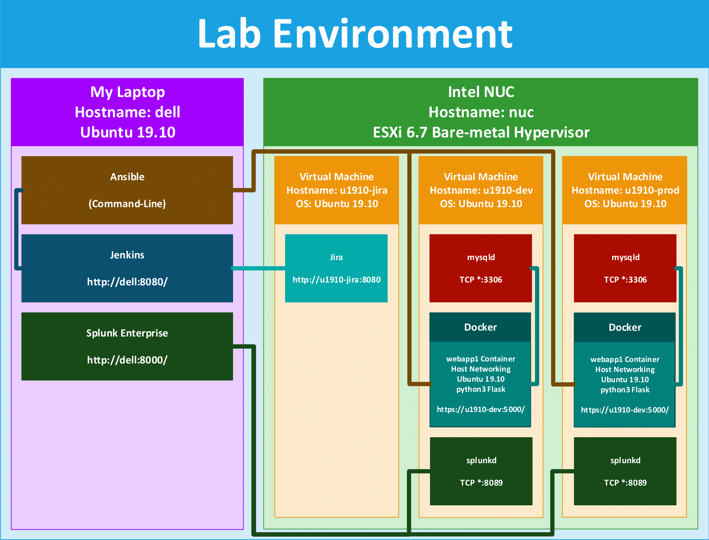

# webapp1 by MarcAnthony Fanfan

Made using Python & Flask

Useful Links (Only work on my local network)

- Dev: https://u1910-dev:5000/
- Prod: https://u1910-prod:5000/
- Jira: http://u1910-jira:8080/
- Jenkins: http://dell:8080/
- Splunk: http://dell:8000/

Build simple web application that performs the following (all user data will be stored in SQL):
1. Provide a password protected web application
2. Allow a user to create a username/password
3. Allow user to login to web application
4. Create a password protected page that allows a user to request a network account, the request should be visible to an administrator when they login to the web application

# Lab Environment Diagram

# Application Process Diagram
